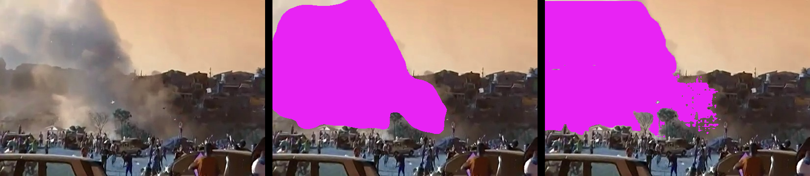
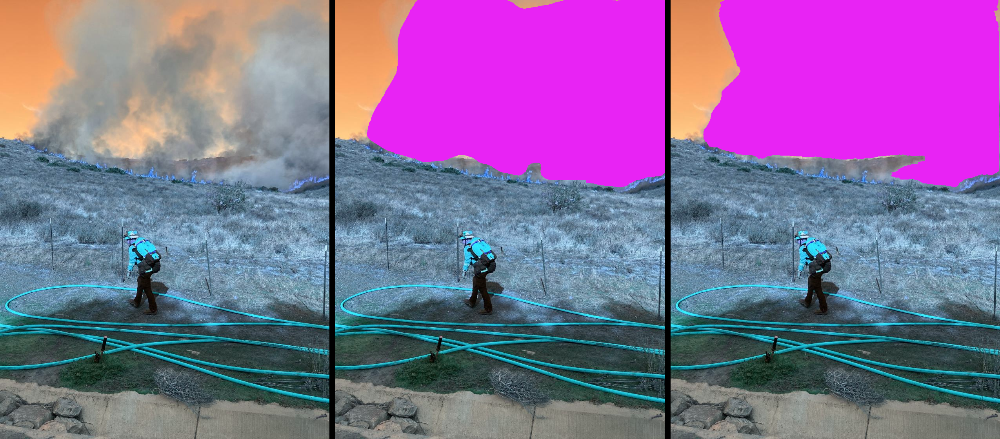
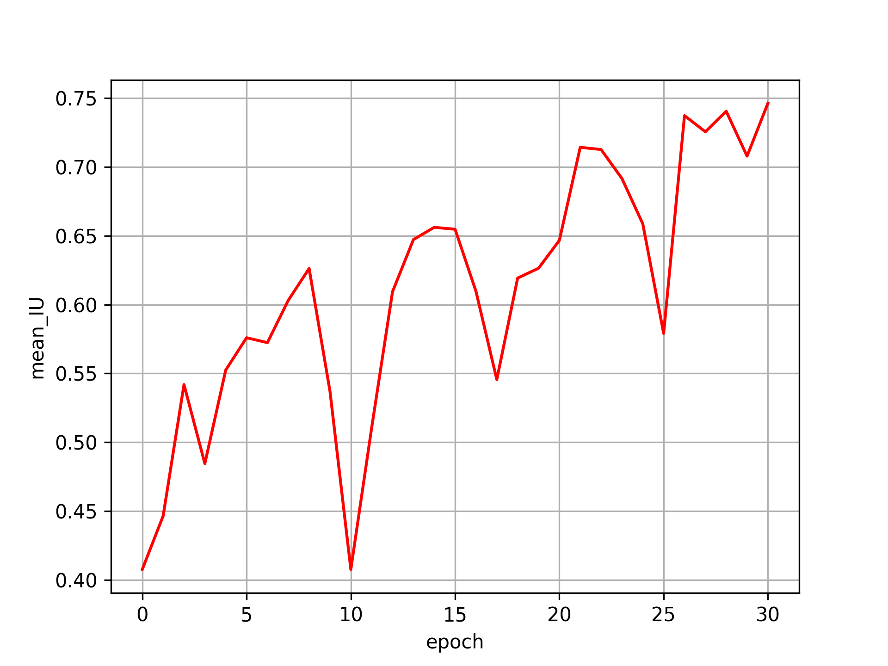

# Smoke Segmentation Project

The objective of this repository is to provide the means to create a large image dataset for the task of smoke segmentation. It also provides the corresponding tools (including a segmentation UI) for image data curation and a guide to automatically convert a large amount of image detection-based labels to image segmentation labels. Additionally it encompasses the methods and tools to fine-tune a pre-trained smoke segmentation model based on external pre-trained segmenters.

## Demo

This current BiSeNet model relies on the R18 backbone, and is pre-trained on the Cityscapes dataset, with the total number of epochs set to 30.
- Number of train instances 2400
- Number of test instances 287
All instance ground truth masks were generated by [[SAM](https://segment-anything.com/)]. The resulting predictions along with a metrics diagram follows to showcase the model's performance.




The left image shows the input, the middle image is the combination of the input with the predicted segmentation mask, and the right image is the (pseudo) ground truth mask acquired by SAM.



The depicted mean IU is computed on the validation set.

## Release Log

### Release v0.9.0

- Figure with mean IU plot during training
- ~~Access to moderately trained S-smoke segmenters~~ (postponed)
- Documentation for the pre-trained smoke segmentation

## D-Fire - External Dataset

[[D-Fire](https://github.com/gaiasd/DFireDataset)] is an image dataset of fire and smoke occurrences designed for machine learning and object detection algorithms with more than 21,000 images. The bounding box labels are stored inside `.txt` files in YOLO format (class + cxcywh).

## S-Smoke

S-Smoke is a dataset consisted of all D-Fire's images, with segmentation mask labels for the task of image smoke segmentation. The ground truth labels were generated from a pre-trained SAM model, guided by the bounding box labels of the D-Fire dataset.

## Data Directory Structure

This is the data's directory structure, located in `./datasets`.
```
datasets
├── config_new
|   └── gen_ssmoke_path_lists.py
├── D-Fire
|   ├── test
|   |   ├── images
|   |   └── det_labels
|   └── train
|       ├── images
|       └── det_labels
└── S-Smoke
    ├── curated
    |   ├── test
    |   |   ├── images
    |   |   ├── seg_labels
    |   |   └── combined
    |   └── train
    └── raw
        ├── test
        |   ├── images
        |   ├── seg_labels
        |   └── combined
        └── train
```

## Preparation

### Directory Structure

<u>The developer has to manually create the preceeding directory structure prior to using any of the provided tools.</u> The D-Fire directory has to be filled with the corresponding files from the dataset. D-Fire's labels and images are expected to be in text and JPG file formats, and be named with the corresponding `.txt` and `.jpg` file extensions. Download and decompress the D-Fire dataset.

This is what the decompressed D-Fire directory will look like initially:
```
D-Fire
├── test
|   ├── det_labels
|   └── images
└── train
    ├── det_labels
    └── images
```
To align the paths with the currently provided scripts, you should rename the directories with names `labels` to `det_labels`.

Now download a pretrained SAM model through [[link](https://dl.fbaipublicfiles.com/segment_anything/sam_vit_l_0b3195.pth)] and place it inside `./models` directory.

### Dependencies

Apply
```
sudo apt-get install ninja-build
```
```
python3 -m pip install -r requirements.txt
```
Finally install [[Apex](https://github.com/nvidia/apex#installation)].

## Next Steps

First visit [[data_tools](https://github.com/fl0wxr/SmokeSegmenter/tree/master/data_tools)] to perform the semi-annotation by carefully following all instructions given by the corresponding `README.md`. After that you may train your own segmentation model through [[primary_segmenter](https://github.com/fl0wxr/SmokeSegmenter/tree/master/primary_segmenter)].

## Citation

- ycszen. Image segmentation tools. [[TorchSeg](https://github.com/ycszen/TorchSeg)]

- <p align="justify">Pedro Vinícius Almeida Borges de Venâncio, Adriano Chaves Lisboa, Adriano Vilela Barbosa: <a href="https://link.springer.com/article/10.1007/s00521-022-07467-z"> An automatic fire detection system based on deep convolutional neural networks for low-power, resource-constrained devices. </a> In: Neural Computing and Applications, 2022.</p>

- Kirillov, A., Mintun, E., Ravi, N., Mao, H., Rolland, C., Gustafson, L., Xiao, T., Whitehead, S., Berg, A., Lo, W.Y., Dollar, P., & Girshick, R. (2023). Segment Anything. arXiv:2304.02643.
